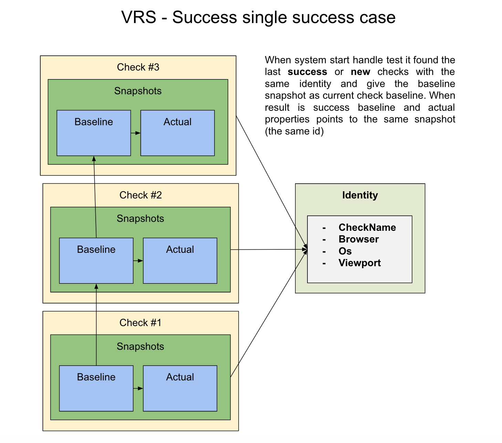

## Syngrisi - Visual Testing Tool

Syngrisi helps to implement Automated Visual Regression Testing along with your new or existing Test Automation Kit, it provides API for Test Automated solutions and a convenient UI tool to review and Visual Test data.

### Prerequisites
 * [NodeJS](https://nodejs.org/en/download/) `v12` or above, it is preferably to use [nvm](https://github.com/nvm-sh/nvm);
 * [MongoDB Community Edition](https://docs.mongodb.com/manual/administration/install-community/)
 
### Quick start

>⚠️ Make sure MongoDB started before run Syngrisi


Clone this project:
```shell script
git clone git@github.com:viktor-silakov/syngrisi.git
```
Go to application folder and install Dependencies 
```shell script
npm i
```

Run Syngrisi server
```shell script
npm run startdebug
```

### Main concept



More descriptive flow (with DOM part) see [here](img/flow.png) 

### Features

* Pix-to-pix comparison
* Perceptual comparison:
    * Offset stabilization
    * Ignore Alpha
    * Ignore Colors
    * Ignore Antialiasing
* Ignore regions
* Works with data hashes that allows quickly perform comparison action.
* Affected elements analyse based on DOM dump and diff image.
* UI panel to observe results and manage test data (baselines, regions, test, suites, runs. etc.) )

### Advance run options

```shell script
npm run start # as detached from current shell process
npm run startdebug # attached to current shell process
npm run startservice # start like service, required forever module globally (https://www.npmjs.com/package/forever) 
```

### Clear database

```shell script
npm run clear
```

### Environment variables
 
 `VRS_BASELINE_PATH` - path to baseline images, default value is `./baselines/`
 
 `VRS_CONN_STRING` - MongoDB connection string, default value is `mongodb://localhost/VRSdb` 
 
 `VRS_PORT` - tcp port for application server, default value is `3000`
 
 `V_SHIFTING` - value for vertical page shifting, default value is `0`
 
 `PAGE_SIZE` - number of tests items on that return `/checks?page={page_num}` API

 `SYNGRISI_AUTH` - enables authentication if equal `1`

 `TEST` - enables test admin user if equal `1`
