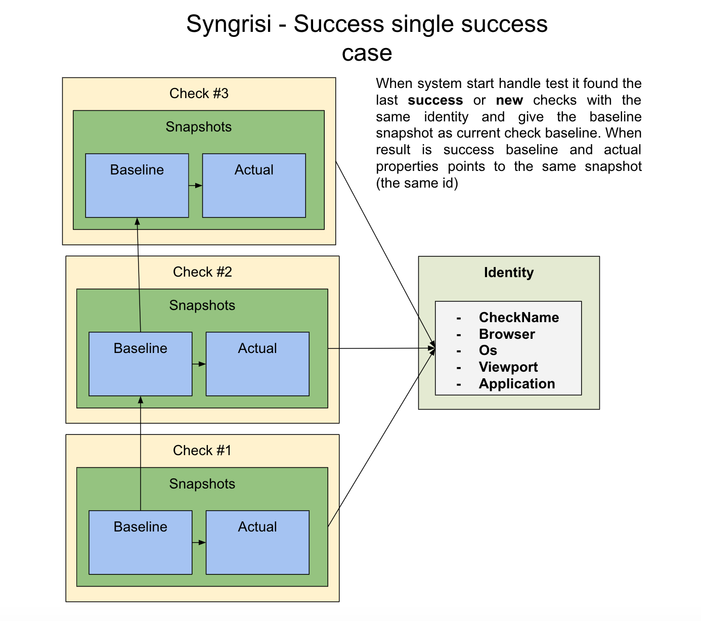

## Syngrisi

### Main concept



### Features

* Pix-to-pix comparison
    * Perceptual comparison:
    * Antialiasing
    * Offset stabilization
    * Ignore regions
    * Works with data hashes that allows quickly perform comparison action.
    * Affected elements analyse based on DOM dump and diff image.
    * UI panel to observe results and manage test data (baselines, regions, test, suite, etc.) )

### Prerequisites

 * [NodeJS](https://nodejs.org/en/download/) ver `v13.13.0` or above, it is preferably to use [nvm](https://github.com/nvm-sh/nvm);
 * [MongoDB Community Edition](https://docs.mongodb.com/manual/administration/install-community/)
 
### Installation

> `npm i`

### Run

```shell script
npm run start # as detached from current shell process
npm run startdebug # attached to current shell process
npm run startservice # start like service, required forever module globally (https://www.npmjs.com/package/forever) 
```

### Clear database

```shell script
npm run clear
```

 ### Environment variables
 
 `VRS_BASELINE_PATH` - path to baseline images
 `VRS_CONN_STRING` - mongo db connection string
 `VRS_PORT` - tcp port for application server (default is 3000)
 `V_SHIFTING` - value for vertical page shifting
 
